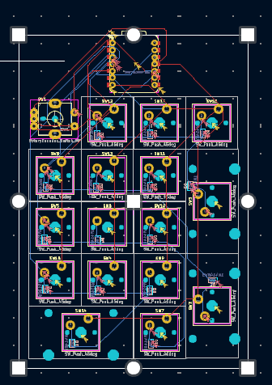
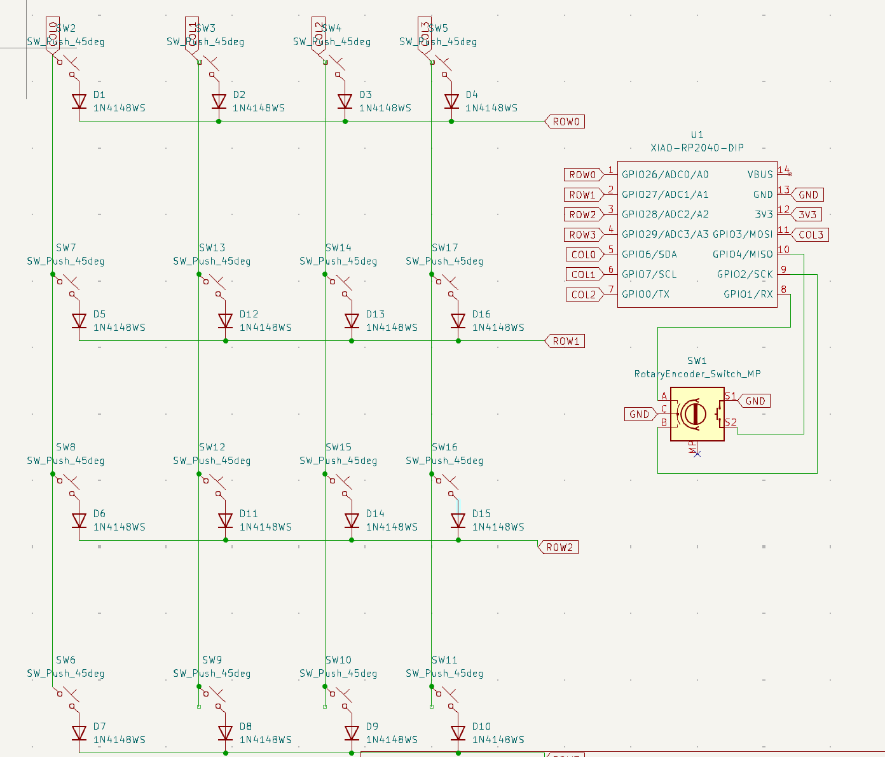
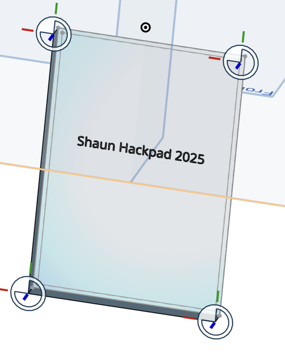

# Shaun's Epic HackPad

This sigma HackPad is a numpad style doo dad.

[Bill of Materials](./BOM.md)

[Devlog](./Devlog.md)

## Pictures

https://github.com/Shaun475/HackPad/blob/main/assets/IMG_1091.jpeg

